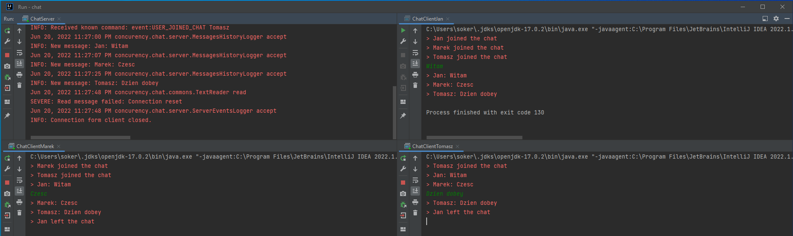
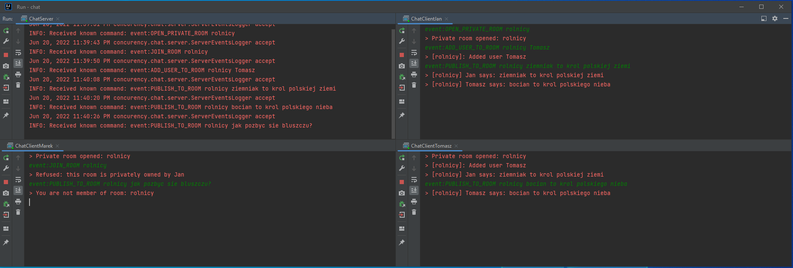
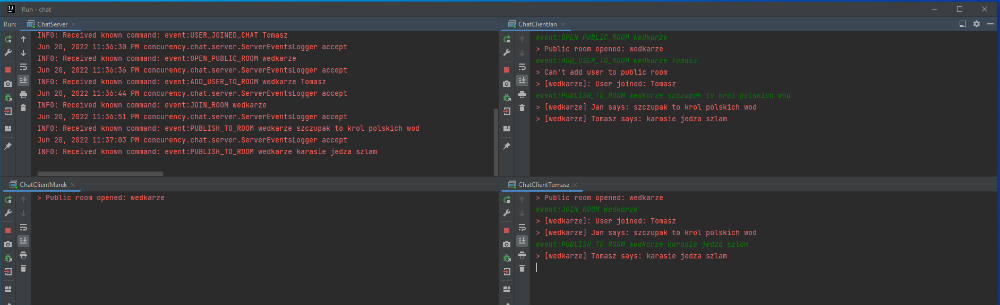
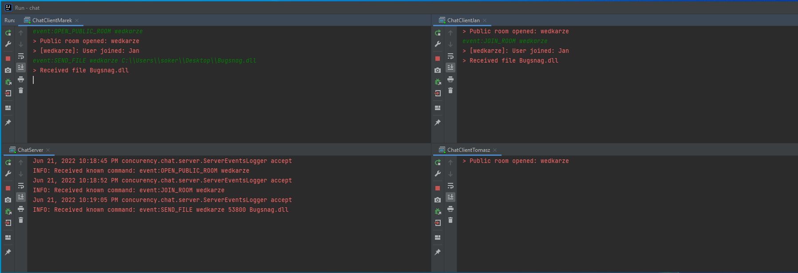
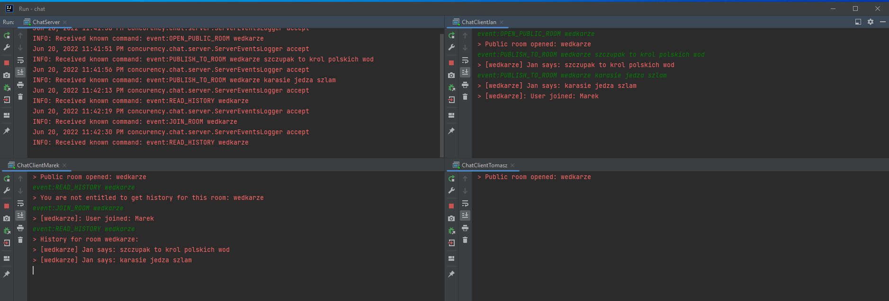

#PROJECT 1 - CHAT

Chat application supports sending messages to public room as well as special commands in form: event:<command> <args>

Supported functionalities are: 

####MAIN CHAT:

* Message written by one user should be broadcast to all connected users.  
* Users present in chat should receive notification that user joined the chat.
* Users present in chat should receive information that user left the chat.

####PRIVATE ROOM:
* User can open private room and become owner of it
* Owner can add other users to room
* User can not join room on its own
* Message send to room is received by all room members   
* Possible commands are as below:  
  *event:OPEN_PRIVATE_ROOM rolnicy*  
  *event:ADD_USER_TO_ROOM rolnicy Tomasz*  
  *event:PUBLISH_TO_ROOM rolnicy My message* 

####PUBLIC ROOM:
* User can open public room  
* Other users can join room on their own
* Users can not be added to room by other users
* Message send to room is received by all room members
* Possible commands are as below:  
  *event:OPEN_PRIVATE_ROOM rolnicy*  
  *event:JOIN_ROOM rolnicy*  
  *event:PUBLISH_TO_ROOM My message*  

####FILE TRANSFER
* It is possible to broadcast file to all room members  
* File is stored within chat client process work dir  
* Message about file received is displayed to file receivers  
* The functionality does not prompt - the assumption was tha it simulates sending image/gif to other users  
* Command to trigger file transfer is as below:  
  *event:SEND_FILE wedkarze C:\\Users\\soker\\Desktop\\Bugsnag.dll*  

####CHAT HISTORY
* Once user becomes member of the room, it is possible for it to retrieve all conversation history for given room  
* Command to fetch history is:  
  *event:READ_HISTORY wedkarze*  

==================================================================================================  
RANDOM DEV NOTES BELOW - DON'T READ UNLESS FORCED  
==================================================================================================  

Work diary

-> Initial implementation treats each incoming connection as new user and broadcast each message to each user. This restricts sending special messages, like /open-room, /send-file, etc. Connection is than indexed by worker id.
Incoming connection should not result in adding new worker immediately. Client, after connecting should introduce automatically - send message with nickname. Workers associated with users should be added in aggregating container (e.g. hash map) and keyed by name.
The goals are: add another layer of processing, so messages intended to be special commands, are handdled and consumed by some other entity. Only after filtering there, are passed to broadcast to all users. Also, this will enable users to connect directly (eg. in rooms), inviting users to rooms, sending files, etc.

-> Initial implementation of room feature is completed.
-> Implemented rooms functionality - added most features

TODO:

-> General:
    Do not broadcast empty lines
    Do not broadcast this log May 31, 2022 11:58:18 PM concurency.chat.commons.TextReader read
    Implement utils, in order not to copy code to broadcast message
    Connect enum to string representation. Add message handler in enum (i.e. function which should be invoked in order to handle this message. Enum class?)
    Thread.sleep(HANDSHAKE_WAIT_SLEEP_INTERVAL_MS); - this is busy waiting
    SpecialMessageHandler - rename to SpecialMessageConsumer

    SpecialMessageHandler - change to UserSpecialRequestHandler. Events should be changed to requests. MessageHandler is implemented.
    RoomHandler should be changed to RoomRequestHandler. Logic should be moved to MessageHandler. 

-> Rooms:
    (DONE) ADD_USER_TO_ROOM - change this to JOIN_ROOM. It should be possible for every user to join each room. This will complete public room
    (DONE) Implement parsing messages, don't use hardcoded values
    (DONE) Add field to indicate if room is private or public
    (DONE) ADD_USER_TO_ROOM - it should be invoked to add user to private room. Only room creator should be able to add user to this room.
    Add broadcasted information about room opened/closed and if it is public or private
    (DONE) CLOSE_ROOM - only user creator should be able to invoke it.
    Add sending back to room members information about events in room (e.g. user joined, left)
    (DONE) Handle cases in which the room already exists / does not exist  

-> File transfer
    (DONE) Users should be able to send files to broadcast file to all users in room
    (DONE)     User should send even:SEND_FILE <room_name> <file_path>
    (DONE) Client side application should open server with new socket with given <socket_id>, which will be used to transmit file
    (DONE) Client side application should publish file to content to socket
    (DONE) Input message should be transformed to be of form event:SEND_FILE <room_name> <port>
    (DONE) Room should open connection to given socket and act as client to receive file
    At the same time all room members should receive information that there is file to download.
    (ABANDONED FOR IT WAS TOO COMPLICATED )In case user confirms with command event:ACCEPT_FILE <file_name>, new thread should be created to receive file contents
    (DONE - better not) Is there new socket needed? Better use the same one to transfer files and data

-> Logging
    New consumer should be added to handle message LOG_MESSAGE created for logging and perhaps others (e.g. WRITE_TO_ROOM)
    Consumer should create file and write messages - previously decorate it with timestamp
    Composition! So the writer can be exchanged later, for instance not to write to flat file, but some other messages sink
    Users should store which rooms there were in. Initially user should be able to fetch all history, optional feature is only during time where user was in room. 
    FETCH_HISTORY - should be consumed by the same consumer. This means that we should be able not only to write to the file, but also read. 
    Read log should be concluded with PUBLISH_HISTORY message publishes, with log as payload. It should be consumed by dedicated consumer, who should have access to collection of users. Only requester should be sent 
    

    This should have nothing to do with code handling rooms. Therefore, information about rooms in 
    which user participated should be stored in user (aka Worker at this point).
    It will be used in future to receive history anyway. 
    Flow should be:
        - sender sends file transfer request to receiver
        - receiver needs to confirm if the file is accepted: yes / no
        - yes answer should contain file location as well. 
        - in case user accepts - file transfer starts (in new thread). In case user declines - nothing happens
    Add history of rooms in users.
    Add file transfer request handler. Initially it should provide layers for communication only
    
SEND_FILE room_name read_file_path socket_id

Control messages:

FT:
    TODO:
        event:SEND_FILE room_name read_file_path

ROOMs:
    DONE:
    event:OPEN_ROOM <room name>
    event:CLOSE_ROOM <room name>
    event:PUBLISH_TO_ROOM <room name> <message>
    event:ADD_USER_TO_ROOM <user name>
    event:JOIN_ROOM <room_name>
    
    TODO:
    event:REMOVE_FROM_ROOM <room name> Marek

MANUAL TEST SCENARIOS:

PRIVATE ROOM:
1. User should be able to open private room.
   event:OPEN_PRIVATE_ROOM wedkarze
2. Name of the room should be unique. User should be notified with appropriate message if room already exists
3. Other users should not be able to join private room. Notification should be transferred back to user.
   event:JOIN_ROOM wedkarze
4. Other users could be added to room only by room owner. All members should be notified about user added to room.
   event:ADD_USER_TO_ROOM wedkarze Marek
   event:ADD_USER_TO_ROOM wedkarze Tomasz
5. TODO: Owner should be able to remove user from room. Removed user should receive notification.
   event:REMOVE_USER_FROM_ROOM wedkarze Marek
6. Members of room should receive message written by any user. Non-members users should not receive message.
   event:PUBLISH_TO_ROOM wedkarze szczupak to krol polskich wod
7. Owner should be able to close the room 
   event:CLOSE_ROOM wedkarze

PUBLIC ROOM:
1. User should be able to open private room.
   event:OPEN_PUBLIC_ROOM wedkarze
2. Name of the room should be unique. User should be notified with appropriate message if room already exists
3. Users should not be able to add other users to public room
   event:ADD_USER_TO_ROOM wedkarze Marek
4. User should be able to join public room
   event:JOIN_ROOM wedkarze
5. TODO: User should be able to leave room. After leaving the room notification to others should be send.  
    event:LEAVE_ROOM wedkarze Marek
6. User should be able to publish to room:
   event:PUBLISH_TO_ROOM wedkarze szczupak to krol polskich wod
7. Members of room should receive message written by any user. Non-members users should not receive message.
   event:PUBLISH_TO_ROOM wedkarze szczupak to krol polskich wod

3) 
    event:OPEN_PUBLIC_ROOM wedkarze
    event:JOIN_ROOM wedkarze
    event:PUBLISH_TO_ROOM wedkarze szczupak to krol polskich wod
    event:PUBLISH_TO_ROOM wedkarze karasie jedza szlam
4) 
    event:OPEN_PRIVATE_ROOM rolnicy
    event:JOIN_ROOM rolnicy
    event:PUBLISH_TO_ROOM rolnicy ziemniak to krol polskiej ziemi
    event:PUBLISH_TO_ROOM rolnicy jak pozbyc sie bluszczu

    
     

